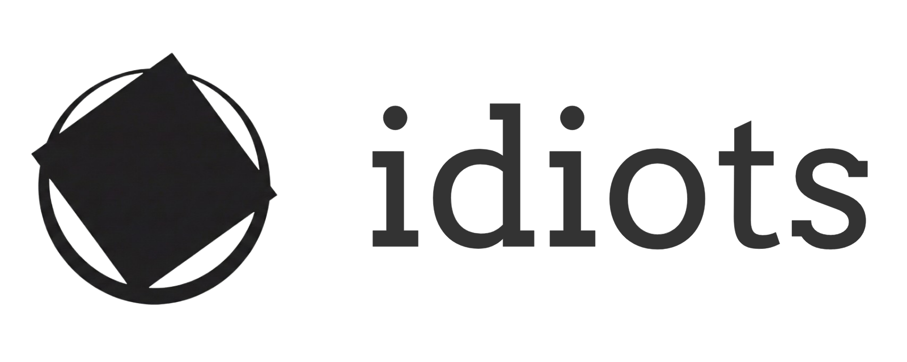

# Idiots Website Project

[](LICENSE)
[](https://www.php.net/)
[](https://www.mysql.com/)

一个轻量级、现代化设计的个人博客/CMS系统。基于原生 PHP 构建，拥有优雅的界面和高效的性能。



## ✨ 特性

- **现代化设计**: 采用 "Academic Crimson" 配色与磨砂玻璃 (Glassmorphism) 效果，提供极佳的视觉体验。
- **响应式布局**: 完美适配桌面端与移动端，随时随地管理内容。
- **文章管理**: 强大的后台管理系统，支持 Markdown 编辑、标签分类、封面图设置。
- **评论系统**: 内置评论回复功能，支持嵌套评论。
- **用户权限**: 分级用户管理（管理员/普通用户）。
- **SSO 支持**: 集成 Wildhens Passport 单点登录（可选）。
- **SEO 优化**: 内置伪静态规则与语义化标签。

## 🛠️ 环境要求

- **PHP**: 7.4 或更高版本
- **Database**: MySQL 5.7+ / MariaDB 10.2+
- **Web Server**: Nginx (推荐) 或 Apache
- **Extensions**: `mysqli`, `mbstring`, `gd`, `curl`

## 🚀 快速安装

本项目提供了一个直观的 Web 安装向导，只需几步即可完成部署。

### 1. 克隆代码
```bash
git clone https://github.com/yourusername/idiots-website.git
cd idiots-website
```

### 2.配置 Web 服务器
将网站根目录指向项目文件夹。
- **Nginx 用户**: 请参考根目录下的 `nginx_rewrite_rules.txt` 配置伪静态规则。

### 3. 设置权限
确保 web 服务器对根目录（用于生成 `config.php`）和 `uploads/` 目录有写入权限。

### 4. 运行安装向导
在浏览器中访问：
```
http://your-domain.com/install/
```
按照屏幕提示输入数据库信息和管理员账户信息即可。

安装完成后，系统会自动生成 `config.php` 并锁定安装程序。

---

## 手动安装 (可选)

如果你无法使用 Web 安装程序，可以按照以下步骤手动安装：

1.  重命名 `config.sample.php` 为 `config.php`。
2.  编辑 `config.php`，填入你的数据库信息。
3.  将 `database.sql` 导入到你的 MySQL 数据库中。
4.  默认管理员账户：
    -   用户名: `admin`
    -   密码: `password` (请登录后立即修改!)

## 📁 目录结构

```
.
├── admin/          # 后台管理系统
├── assets/         # 静态资源 (CSS, JS, Images)
├── includes/       # PHP核心库与组件
├── install/        # 安装向导
├── uploads/        # 用户上传的文件
├── config.php      # 配置文件 (安装后生成)
├── index.php       # 首页
└── database.sql    # 数据库结构文件
```

## 🔒 安全说明

- 生产环境请确保 `display_errors` 在 `config.php` 中设置为 0。
- 安装完成后，建议删除 `install` 目录或保留 `install.lock` 文件。
- 敏感信息（如数据库密码）存储在 `config.php` 中，请确保该文件不被泄露。

## 📄 开源协议

MIT License
